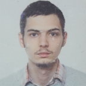
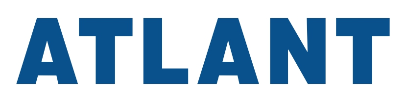
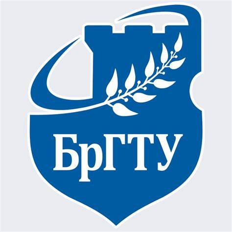
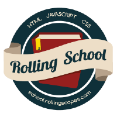
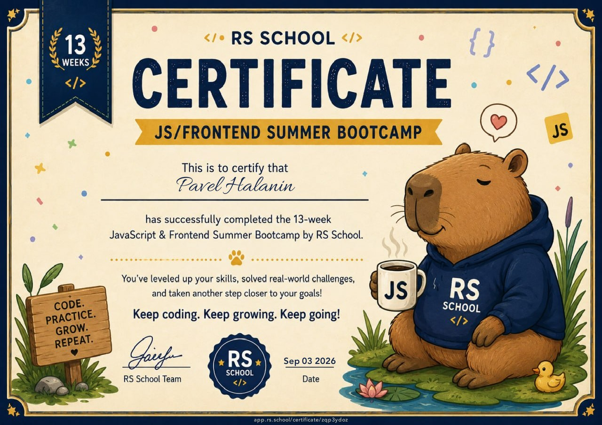
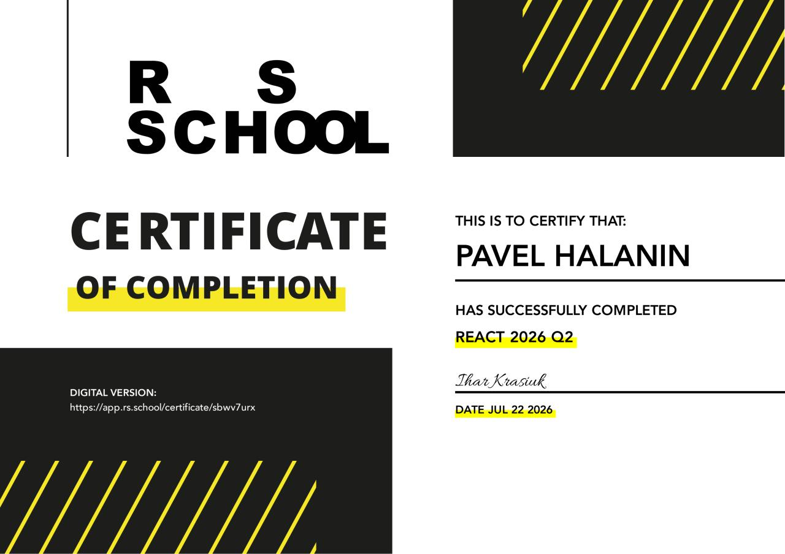
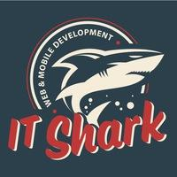
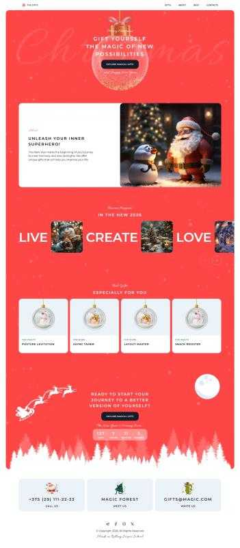
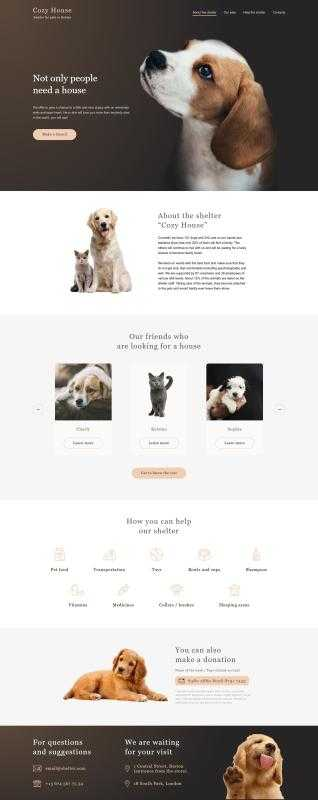

# CV

## Nav

- [EN CV](#en-cv)
  - [1. Full Name](#1-full-name)
  - [2. Contact information](#2-contact-information)
  - [3. Brief Self-Introduction](#3-brief-self-introduction)
  - [4. Skills](#4-skills)
  - [5. Code Examples](#5-code-examples)
  - [6. Work Experience](#6-work-experience)
  - [7. Education](#7-education)
  - [8. English Language](#8-english-language)
- [RU CV](#ru-cv)
  - [1. Имя](#1-имя)
  - [2. Контактная информация](#2-контактная-информация)
  - [3. Краткая информация о себе](#3-краткая-информация-о-себе)
  - [4. Навыки](#4-навыки)
  - [5. Примеры кода](#5-примеры-кода)
  - [6. Опыт работы](#6-опыт-работы)
  - [7. Образование](#7-образование)
  - [8. Английский язык](#8-английский-язык)
- [Footer](#footer)

## EN CV

### 1. Full Name



Pavel Halanin

### 2. Contact information

- Phone: [+375-33-331-32-03](tel:+375333313203)
- E-mail: [pavelhalanin@outlook.com](mailto:pavelhalanin@outlook.com)
- Discord: [pavgal](https://discord.com/users/1482615972060991488)
- GitHub: [pavelhalanin](https://github.com/pavelhalanin)
- LinledIn: [pavelhalanin](https://www.linkedin.com/in/pavelhalanin/)
- CodeWars: [rsschool](https://www.codewars.com/users/rsschool_7f3e087f4b5570c1)

### 3. Brief Self-Introduction

I graduated from Brest State Technical University with a degree in Information Technology Software. Obtained a higher education diploma with honors, qualifying as a Software Engineer. I have been working in the field since 2023 (3 years of experience). Obtained a driver's license for categories: Am, B, C. In 2026, I joined RS School. In the spring of 2026, I successfully completed Stage 0. In the summer of 2026, I completed the [Stage 3 React course and received a certificate](https://app.rs.school/certificate/sbwv7urx). Also in the summer of 2026, I completed the [Stage 0.5 course and obtained a certificate](https://app.rs.school/certificate/zqp3ydoz). In the autumn of 2026, I am taking the Stage 1–2 course.

### 4. Skills

- programming languages: JavaScript, TypeScript, PHP, SQL
- frameworks: React, ReactNative, NextJS, NestJS
- state manager: Zustand
- methodologies: ARIS, UML
- version control systems: Git (GitHub, GitLab), SVN
- IDE: VS Code
- Package Managers: npm, yarn
- Debugging Tools: Chrome DevTools
- Operating Systems: Windows, Linux
- API Testing: Postman, SwaggerUI, OpenAPI
- Markup & Documentation Languages: HTML, CSS, MarkDown, LaTeX, JSON
- Databases: MySQL, Oracle, SQLite, DBF, Supabase
- Containers & Virtualization: Docker, docker-compose
- Design: Figma, Photopea, Adobe Photoshop
- Hosting & Server Management: cPanel, ISPmanager, Login.by
- Domain: hoster.by, beCloud, gh-pages
- Domain Name System: login.by, cloudflare
- Local AI Models for RAG: Ollama
- AI agents: ChatGPT, Deepseek, YandexGPT, GoogleGPT, Copilot, Duck.ai
- DevOps & Infrastructure: Apache, WAMP, nginx

### 5. Code Examples

```js
function getCardId(value) {
    const ARRAY_RANK = ['A', '2', '3', '4', '5', '6', '7', '8', '9', '10', 'J', 'Q', 'K'];
    const ARRAY_SUIT = ['♣', '♦', '♥', '♠'];
    const RANK = `${value}`.replace(/[♣♦♥♠]$/, '');
    const SUIT = `${value}`.replace(/[^♣♦♥♠]/g, '');
    const RANK_ID = ARRAY_RANK.indexOf(RANK);
    const SUIT_ID = ARRAY_SUIT.indexOf(SUIT);
    return RANK_ID + 13 * SUIT_ID;
}
```

```js
async function fetchData(unp) {
  const URI = `https://grp.nalog.gov.by/api/grp-public/data?unp=${unp}&charset=UTF-8&type=json`;
  const RESPONSE = await fetch(URI);

  const HTTP_STATUS = RESPONSE.status;
  if (HTTP_STATUS !== 200) {
    const TEXT = await RESPONSE.text();
    throw new Error(`HTTP ${HTTP_STATUS}\n${TEXT}`);
  }

  const DATA = await RESPONSE.json();
  return DATA;
}

(async function() {
  try {
    const DATA = await fetchData('100582333');
    console.info(DATA);
  }
  catch(exception) {
    console.error(exception);
  }
})();
```

### 6. Work Experience

-  ZAO ATLANT, Minsk
  - Period: December 2025 - present
    - job title: 2nd category Software Engineer
  - Period: June 2024 - December 2025
    - job title: Software Enginer
-  OOO DE-PA, Brest
  - Period: June 2023 - December 2024
    - job title: Software Enginer

### 7. Education

-  Brest State Technical University
  - Type: Diploma of Higher Education with Honors
  - Specialty: Information Technology Software
  - Qualification: Software Engineer

#### Courses

-  RS School
  - [Stage 0.5] JS/Frontend Summer bootcamp 2026Q2
    - Period: 01.06.2026 - 03.09.2026
    - [Certificate](https://app.rs.school/certificate/zqp3ydoz)

      [](https://app.rs.school/certificate/zqp3ydoz)

  - [Stage 3] React 2026 Q2
    - Period: 27.04.2026 - 21.07.2026
    - [Certificate](https://app.rs.school/certificate/sbwv7urx)

      [](https://app.rs.school/certificate/sbwv7urx)
  - [Stage 0] JS/Frontend Pre-School 2026 Q1
    - Period: 16.03.2026 - 08.05.2026

-  IT Shark Pro
  - Period: 2018 - 2019

#### Educational projects

- Christmas shop:
  [website](https://pavelhalanin.github.io/RSSchool_2026Q1_Stage0__ChristmasShop/)
  |
  [repository](https://github.com/pavelhalanin/RSSchool_2026Q1_Stage0__ChristmasShop)

[](https://pavelhalanin.github.io/RSSchool_2026Q1_Stage0__ChristmasShop/)

- Schelter
  [website](https://pavelhalanin.github.io/RSSchool_2026Q2_Stage0.5__shelter/)
  |
  [repository](https://github.com/pavelhalanin/RSSchool_2026Q2_Stage0.5__shelter)

[](https://pavelhalanin.github.io/RSSchool_2026Q2_Stage0.5__shelter/)

### 8. English Language

I read, I speak fluently. I've been practicing English for 12 years.

Other languages:
- Russian - native Landuage
- Belarusian - native Landuage

## RU CV

### 1. Имя


Павел Галанин

### 2. Контактная информация

- Телефон: [+375-33-331-32-03](tel:+375333313203)
- Электронная почта: [pavelhalanin@outlook.com](mailto:pavelhalanin@outlook.com)
- Discord: [pavgal](https://discord.com/users/1482615972060991488)
- GitHub: [pavelhalanin](https://github.com/pavelhalanin)
- LinledIn: [pavelhalanin](https://www.linkedin.com/in/pavelhalanin/)
- CodeWars: [rsschool](https://www.codewars.com/users/rsschool_7f3e087f4b5570c1)

### 3. Краткая информация о себе

Окончил Брестский Государственный Технический Университет по специальности "Программное обеспечение информационных технологий". Получил диплом о высшем образовании с отличием с присвоением квалификации "Инженер-программист". По специальности работаю с 2023 года по настоящее время (3 года опыта). Получил водительские права категории: Am, B, C. С 2026 года присоединился к школе RS School. Весной 2026 года успешно закончил Stage0. Летом 2026 года закончил [Stage3 React с сертификатом](https://app.rs.school/certificate/sbwv7urx). Летом 2026 года проходил курс [Stage0.5 и получил сертификат](https://app.rs.school/certificate/zqp3ydoz). Осенью 2026 года прохожу курс Stage1-2.

### 4. Навыки

- языки программирования: JavaScript, TypeScript, PHP, SQL
- фреймворки: React, ReactNative, NextJS, NestJS
- state-менеджеры: Zustand
- методологии: ARIS, UML
- система контроля версий: Git (GitHub, GitLab), SVN
- среда разработки: VS Code
- пакетный менеджер: npm, yarn
- средства откладки кода: Chrome DevTools
- операционные системы: Windows, Linux
- тестирование API: Postman, SwaggerUI, OpenAPI
- языки разметки и языки документации: HTML, CSS, MarkDown, LaTeX, JSON
- базы данных: MySQL, Oracle, SQLite, DBF, Supabase
- контейнеры и виртуализация: Docker, docker-compose
- дизайн: Figma, Photopea, Adobe Photoshop
- хостинг и управление серверами: cPanel, ISPmanager, Login.by
- домен: hoster.by, beCloud, gh-pages
- Система доменных имён: login.by, cloudflare
- Локальные ИИ модель для обучения на документах: Ollama
- ИИ агенты: ChatGPT, Deepseek, YandexGPT, GoogleGPT, Copilot, Duck.ai
- разработка, эксплуатация, инфраструктура: Apache, WAMP, nginx

### 5. Примеры кода

```js
function getCardId(value) {
    const ARRAY_RANK = ['A', '2', '3', '4', '5', '6', '7', '8', '9', '10', 'J', 'Q', 'K'];
    const ARRAY_SUIT = ['♣', '♦', '♥', '♠'];
    const RANK = `${value}`.replace(/[♣♦♥♠]$/, '');
    const SUIT = `${value}`.replace(/[^♣♦♥♠]/g, '');
    const RANK_ID = ARRAY_RANK.indexOf(RANK);
    const SUIT_ID = ARRAY_SUIT.indexOf(SUIT);
    return RANK_ID + 13 * SUIT_ID;
}
```

```js
async function fetchData(unp) {
  const URI = `https://grp.nalog.gov.by/api/grp-public/data?unp=${unp}&charset=UTF-8&type=json`;
  const RESPONSE = await fetch(URI);

  const HTTP_STATUS = RESPONSE.status;
  if (HTTP_STATUS !== 200) {
    const TEXT = await RESPONSE.text();
    throw new Error(`HTTP ${HTTP_STATUS}\n${TEXT}`);
  }

  const DATA = await RESPONSE.json();
  return DATA;
}

(async function() {
  try {
    const DATA = await fetchData('100582333');
    console.info(DATA);
  }
  catch(exception) {
    console.error(exception);
  }
})();
```

### 6. Опыт работы

-  ЗАО АТЛАНТ, Минск
  - Период: декабрь 2025 - настоящее время
    - должность: инженер-программист 2-ой категории
  - Период: июнь 2024 - декабрь 2025
    - должность: инженер-программист
-  ООО "ДЕ-ПА", Брест
  - Период: июнь 2023 - декабрь 2024
    - должность: инженер-программист

### 7. Образование 

-  Брестский Государственный Техничесский Универсистет
  - Тип: диплом о высшем образовании с отличием
  - Специальность: Программное обеспечение информационных технологий
  - Квалификация: инженер-программист

#### Курсы

-  RS School
  - [Stage 0.5] JS/Frontend Summer bootcamp 2026Q2
    - Период: 01.06.2026 - 03.09.2026
    - [Сертификат](https://app.rs.school/certificate/zqp3ydoz)

      [](https://app.rs.school/certificate/zqp3ydoz)

  - [Stage 3] React 2026 Q2
    - Период: 27.04.2026 - 21.07.2026
    - [Сертификат](https://app.rs.school/certificate/sbwv7urx)

      [](https://app.rs.school/certificate/sbwv7urx)

  - [Stage 0] JS/Frontend Pre-School 2026 Q1
    - Период: 16.03.2026 - 08.05.2026

-  IT Shark Pro
  - Период: 2018 - 2019

#### Учебные проекты

- Рождественский магазин:
  [вебсайт](https://pavelhalanin.github.io/RSSchool_2026Q1_Stage0__ChristmasShop/)
  |
  [репозиторий](https://github.com/pavelhalanin/RSSchool_2026Q1_Stage0__ChristmasShop)


[](https://pavelhalanin.github.io/RSSchool_2026Q1_Stage0__ChristmasShop/)

- Питомник:
  [вебсайт](https://pavelhalanin.github.io/RSSchool_2026Q2_Stage0.5__shelter/)
  |
  [репозиторий](https://github.com/pavelhalanin/RSSchool_2026Q2_Stage0.5__shelter)

[](https://pavelhalanin.github.io/RSSchool_2026Q2_Stage0.5__shelter/)

### 8. Английский язык

Я читаю и свободно говорю. Я занимаюсь английским уже 12 лет

Другие языки:
- русский язык - родной язык
- белорусский язык - родной язык

## Footer

<div align="center">
  <div>
    <a
      href="https://rs.school/courses/javascript"
      title="Course link
  Ссылка на курс"
    >
      
    </a>
  </div>
  <div>
    © 2026 <a
      title="Link to GitHub
  Ссылка на GitHub"
      href="https://github.com/pavelhalanin">
      Pavel Halanin
    </a>
  </div>
</div>
